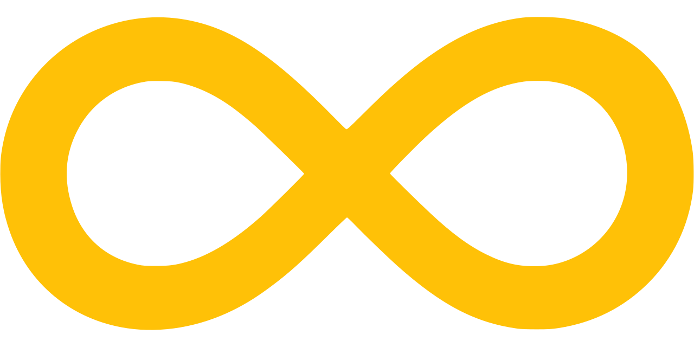

 # inifnite-scroll 
Easy Component for using in your project (with example)

# Usage:

```js
import React, {useEffect, useState, useRef} from 'react';
import axios from "axios";
import RenderPosts from "./RenderPosts";
import Indicator from "./Indicator";

const OBSERVER_OPTIONS = {
    root: null,
    rootMargin: "20px",
    threshold: 1.0
};

export default function InfiniteScroll() {
    const [posts, setPosts] = useState([])
    const [offset, setOffset] = useState(1); // tracking offset
    const loaderRef = useRef(null);   //  load indicator ref

    const getPhotos = (offset = 1) => {
        const url = `https://jsonplaceholder.typicode.com/photos?_page=${offset}&_limit=10`
        axios.get(url).then(res => setPosts([...posts, ...res.data]));
    }

    const loadMorePosts = () => getPhotos(offset)
   
    //  handle what happens when reaching end of the list
    const doOnReachEnd = (entities) => {
        const target = entities[0];
        if (target.isIntersecting) setOffset((offset) => offset + 1)
    }

    useEffect(getPhotos, [])     // first time getting the posts

    useEffect(loadMorePosts, [offset])     // here we simulate adding new posts to List

    useEffect(() => {
        const observer = new IntersectionObserver(doOnReachEnd, OBSERVER_OPTIONS);   // initialize IntersectionObserver
        if (loaderRef.current) observer.observe(loaderRef.current) // attaching observer to Load More
    }, []);

    return (
        <div>
            <RenderPosts posts={posts}/>
            <Indicator loader={loaderRef}/>
        </div>
    )
}
```
